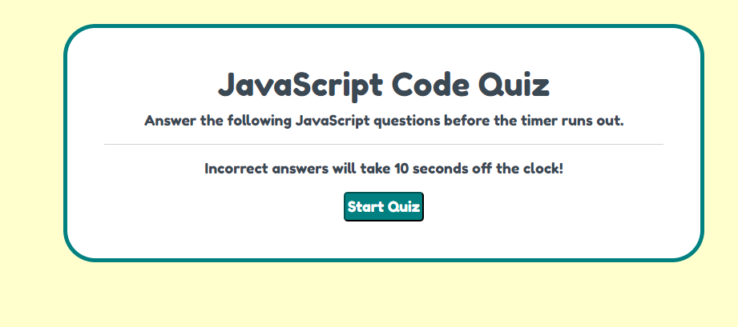

# Timed quiz app

This is a timed quiz on JavaScript fundamentals for students that stores high scores, and gauges the progress compared to your peers.

This app will run in the browser and will feature dynamically updated HTML and CSS powered by JavaScript code that I've written.  It has a clean, polished, and responsive user interface.

# Screenshot

# Deployed Application

[timed-quiz-app](https://ricapi96.github.io/timed-quiz-app/)

# Resources and Contributers

* https://www.w3schools.com

